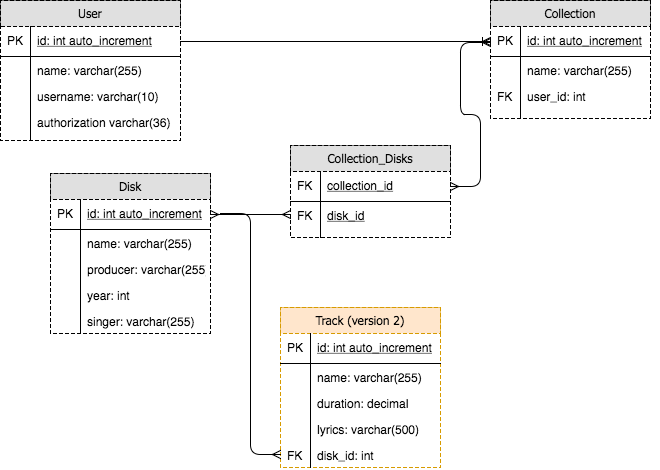

# Introduction

This git repo stores an API written in NodeJS and ExpressJS. MySQL is the
chosen technology for database.

The main goal of this API is to manage Disks. In this context, a disk has 4
properties:

* `name`
* `producer`
* `year`
* `singer`

Each user has an `authorization token` that allows him / her to insert, delete or edit disk information.

An user can also have `collections`. A `collection` is composed by a group of
disks.

In the image below there is a suggestion of structure to store the described objects.
The `Track` table IS NOT IMPLEMENTED in the current version, but the code base
can be extended.



# Running locally

First of all, make sure you have [**`nvm`**](https://github.com/creationix/nvm/blob/master/README.md) installed in your machine.

Then, you need to install the required packages to execute this project. They are described on `package.json` file.

```bash
$ ~(master) > npm install
```

After executing the command above you will find a `node_modules` folder. This is where the local required packages are installed.

Before you proceed, make sure to download the content present in the **`starter`** directory present inside this [Drive](https://drive.google.com/drive/folders/1x9zCRheB9nLfFHejK-RhAtcyI6mrA2PP?usp=sharing) folder and put it locally, at `starter` folder. To do so, go ahead and move the downloaded content after creating `starter` folder:

```bash
$ ~(master) > mkdir starter
$ ~(master) > mv /path-to-downloaded-content/starter/* ./starter/
```

To run this code base locally, you need to have [`Docker`](https://docs.docker.com/install/) and [`Docker Compose`](https://docs.docker.com/compose/install/) installed on your
machine.

We are now going to run a Docker Container with a MySQL database already configured for developing this project.

```bash
$ ~(master) > npm run build-dev-db
```

Now, you can start the API server with the following command line:

```bash
$ ~(master) > MYSQL_PASSWORD=api-user-123 npm start
```

This command is going to run tests and if all tests pass, the API server is going to be available on `http://localhost:3000/`. The implemented features are described on the next session.

## Available Features

All the implmented methods requires the *key:value* `authorization: TOKEN` to be passed on the Header of the request.

Here are the list of available request methods with a brief description:

`GET /`: Welcome message

`GET /collection` : List all available collections for a single user

`GET /collection/:id`: List all disks on the requested collection `:id`

`POST /collection/:id`: Add a disk in the collection `id`, if user is allowed. The disk details should be sent as `x-www-form-urlencoded`. The required fields are:

* `name`
* `producer`
* `year`
* `singer`

**ALERT**: This version is not preventing the insertion of duplicated disks.

`PATCH /disk/:id`: Edit at least one disk field, if the user is allowed.

`DELETE /disk/:id`: Delete disk with `id` from both `collection_disks` and `disk` tables, if user is allowed.

`GET /search/?PARAMETERS`: With this method it is possible to search for text substrings in any disk field. If no valid field is passed by parameter, this request returns all available disks.

# Further available `npm commands`

This session describe other `npm` available commands:

* `npm run delete-dev-db`: will stop and remove the `disks-mysql` container. Before running tests it is recommended to delete and re-build the local database container
* `npm run build-dev-db`: already described. It builds a container (*disks-mysql*) with local MySQL database
* `npm run stop-dev-db`: stops the container running MySQL database
* `npm run start-dev-db`: starts the container running MySQL database
* `npm test`: runs the written tests, which can be found inside `test` folder